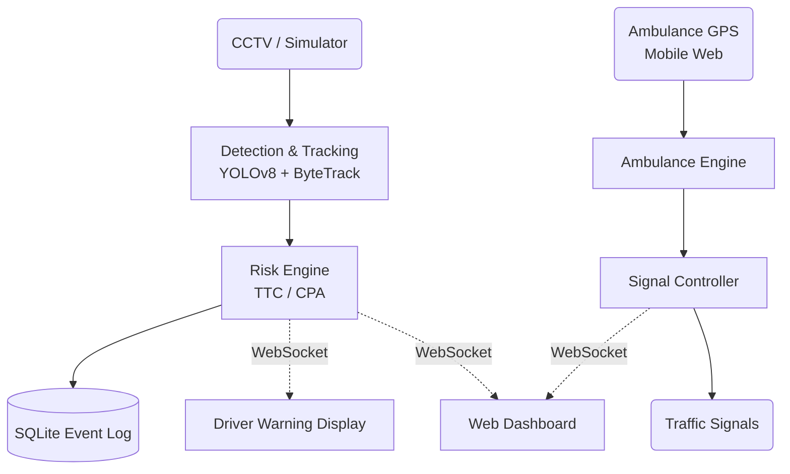
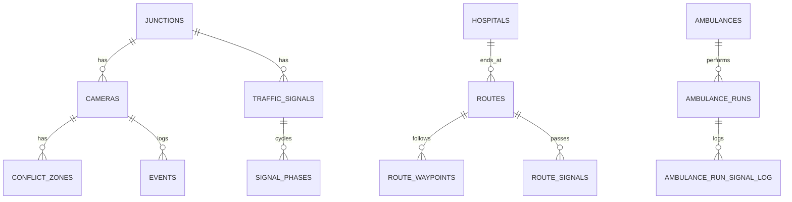

# CityPulse
> **Predictive urban mobility and road safety**
> 
> Python | FastAPI | OpenCV | YOLOv8
> 
> **Team BreakX | Team ID: MS-2026-0198 | Zéphyr 2026 AI Hackathon | Problem Statement PS-1**

## The Problem and the CityPulse Solution

Urban commuting suffers from two critical issues:
1. **Safety for Vulnerable Road Users (VRUs):** Current systems are reactive, detecting collisions rather than predicting and preventing them.
2. **Emergency Response Delays:** Ambulances get stuck at red lights and behind queues.

**CityPulse** is a dual-flow platform that solves both:
- It processes real-time camera feeds to predict Time-To-Collision (TTC) between vehicles and pedestrians/cyclists, issuing warnings *before* accidents happen.
- Simultaneously, it ingests emergency vehicle GPS, looks ahead at the route, and pre-empts traffic signals to grant priority, ensuring safe and rapid passage.

## Features

- **Road Safety Flow:** YOLO-based object detection, multi-frame tracking, TTC calculation, and dynamic driver warnings.
- **Ambulance Flow:** GPS ingestion, signal look-ahead, and state-machine pre-emption.
- **Rich Dashboard:** Single-page web app with live video, real-time alerts, interactive map, and analytics.
- **Driver Display:** A dedicated web-based warning unit for junction hardware.
- **Privacy First:** No face recognition, no number plate reading, zero raw video storage by default.

## System Architecture



## Quick Start

### Windows PowerShell
```powershell
# Create and activate virtual environment
python -m venv venv
.\venv\Scripts\Activate.ps1

# Install dependencies
pip install -r requirements.txt

# Initialize database
python db/init_db.py --reset

# (Optional) Generate historical demo data
python scripts/seed_demo_events.py

# Run the server
uvicorn app.main:app --reload
```

### macOS / Linux
```bash
python3 -m venv venv
source venv/bin/activate
pip install -r requirements.txt
python db/init_db.py --reset
python scripts/seed_demo_events.py
uvicorn app.main:app --reload
```

Open `http://localhost:8000` in your browser.

## Demo Walkthrough (3 Minutes)

1. **Dashboard:** Open `http://localhost:8000`. Click "Start Pipeline" to start the simulator.
2. **Road Safety:** Watch the live feed. Within 60 seconds, a pedestrian or cyclist will cross dangerously close to a car, triggering a Warning (Yellow) or Critical (Red) alert in the feed and on the video overlay.
3. **Hotspots:** Look at the "Risk Hotspots" table to see where near-misses are clustering based on historical demo data.
4. **Ambulance Compare:** In the Ambulance Flow card, click "Compare Both". The system will simulate a baseline run (stopping at red lights) and a priority run (pre-empting lights). The chart updates to show the time saved.
5. **Warning Display:** Open `http://localhost:8000/warning` on a second monitor. It shows "ROAD CLEAR" but reacts instantly when the simulator detects a conflict.
6. **Mobile GPS:** Open `http://localhost:8000/phone` on your phone (must be on the same network). Click "Start Sharing Location" to push real GPS to the ambulance engine.
7. **Validation:** Click "Run All" in the Scenarios card to see the system pass all 6 automated validation tests.

## Using a Real Video

To test the YOLO pipeline instead of the simulator:
1. Place a video file at `data/sample_junction.mp4` (you can run `python scripts/fetch_sample_video.py` to get one).
2. On the dashboard, switch the dropdown from "Simulator" to "Video File / Camera".
3. Click "Start Pipeline".

*Note: The conflict zones defined in the database (table `conflict_zones`) are geometrically tuned for the simulator. To get accurate warnings on your own video, you need to update the `polygon_json` coordinates and the camera's `pixels_per_meter`.*

## Configuration

| .env Variable | Description | Default |
|---------------|-------------|---------|
| `CITYPULSE_HOST` | Server host | `0.0.0.0` |
| `CITYPULSE_PORT` | Server port | `8000` |
| `CITYPULSE_DB_PATH` | SQLite file location | `data/citypulse.db` |

**Risk Configuration** (Live-editable via Dashboard Settings):
| Key | Default | Description |
|-----|---------|-------------|
| `ttc_warning_s` | 3.0 | TTC at or below raises a WARNING |
| `ttc_critical_s` | 1.5 | TTC at or below raises a CRITICAL |
| `prediction_horizon_s` | 5.0 | How far ahead trajectories are predicted |
| `collision_radius_m` | 1.5 | Distance below which conflict exists |
| `alert_cooldown_s` | 4.0 | Cooldown between alerts for same pair |
| `near_miss_ttc_s` | 1.0 | Threshold for near miss logging |

## Database Architecture



- **Resetting:** Run `python db/init_db.py --reset`.
- **Custom City:** To deploy in a new location, update the `junctions`, `hospitals`, and `route_waypoints` tables in `db/seed.sql` with real GPS coordinates.

## API Reference

| Method | Path | Purpose |
|--------|------|---------|
| GET | `/api/state` | System state (pipeline, signals, counters) |
| POST | `/api/pipeline/start` | Start simulator or YOLO |
| GET | `/video_feed` | MJPEG annotated video stream |
| GET | `/api/events` | List historical/live events |
| GET | `/api/metrics` | Aggregate KPIs and latency |
| POST | `/api/ambulance/gps` | Ingest live ambulance location |
| POST | `/api/ambulance/simulate` | Run baseline/priority simulation |
| POST | `/api/scenarios/run-all` | Run all validation tests |

**WebSocket (`/ws`) Messages:**
```json
{
  "type": "alert",
  "event_type": "critical",
  "severity": 3,
  "ttc_s": 1.2
}
```

## Validation and Metrics

CityPulse includes 6 deterministic scenarios tested headlessly without real-time sleep.

| Code | Name | Type | Expected |
|------|------|------|----------|
| SC01 | Approaching pedestrian | Safety | alert |
| SC02 | Approaching cyclist | Safety | alert |
| SC03 | Safe crossing | Safety | no_alert |
| SC04 | High-risk crossing | Safety | critical_alert |
| SC05 | Approaching ambulance | Ambulance | priority_granted |
| SC06 | Ambulance with queue | Ambulance | priority_granted |

Run them via: `python scripts/run_scenarios.py`

**Typical Results (Measured via script):**
- Detection Accuracy: 100.0%
- Warning Accuracy: 100.0%
- False Alerts: 0
- Mean Response Time: ~0.1 - 0.5 ms (Headless)
- Ambulance Journey Time Improv.: ~25%

## Limitations

- Data marked with the "demo data" badge (`is_seed=1`) is illustrative historical data.
- The risk engine uses constant-velocity prediction (doesn't handle sudden swerves).
- Signal pre-emption is demonstrated via software state machine; real deployment requires integration with local traffic controllers (e.g. NTCIP).
- Monocular distance estimation relies on a fixed `pixels_per_meter` approximation.

## Roadmap

1. **V2X/DSRC Integration:** Broadcast warnings directly to connected vehicles.
2. **Multi-Camera Fusion:** Track objects across junctions using homography.
3. **Learned Prediction:** Replace constant-velocity with LSTM trajectory prediction.
4. **Hardware Edge:** Deploy onto NVIDIA Jetson for on-site processing.

## Assumptions Made

- Python 3.14.6 is available and backward-compatible with 3.10-3.12 dependencies.
- CPU inference for YOLOv8 nano is sufficient for the hackathon demo.
- Leaflet map tiles rely on an internet connection (though the core pipeline works offline).
- Driver display uses color flashes for attention, assuming no hardware siren attached.

## Troubleshooting

- **YOLO Download Fails:** Ensure internet connection on first run, or manually place `yolov8n.pt` in the project root.
- **Port 8000 in use:** Run `uvicorn app.main:app --port 8080`.
- **Webcam permission denied:** Check OS privacy settings for Python/Terminal.

---
*Built for the Zéphyr 2026 AI Hackathon by BreakX.*
